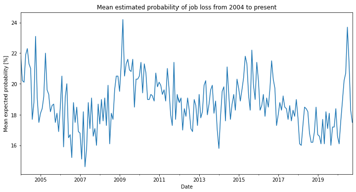

# Dataset presentation
Data was obtained from [the University of Michigan's surveys of consumers](https://data.sca.isr.umich.edu/data-archive/mine.php) (Table 17).
It shows the evolution of the average American's confidence that they (or their spouse) can maintain their job position in the next 5 years, if they desire to. 

## Data Exploration
### Plots 


## Baseline model

## Baseline model
